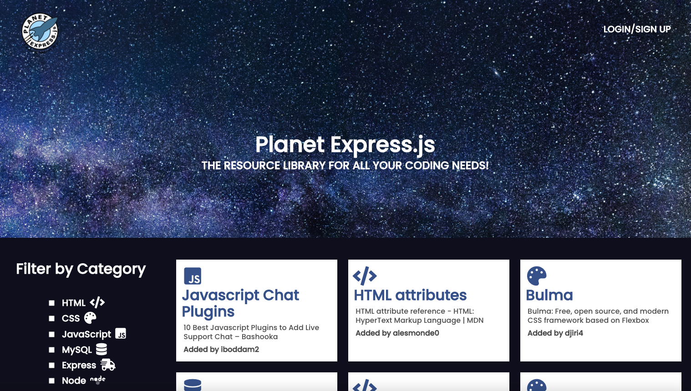
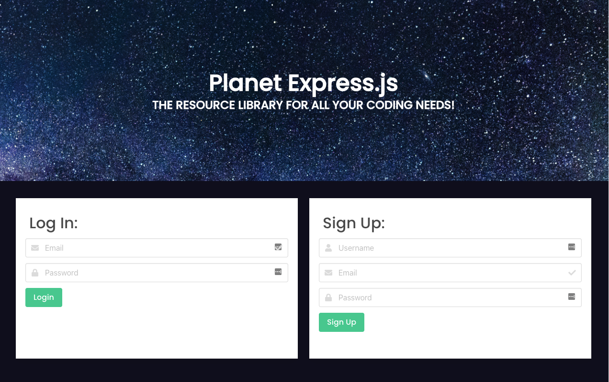
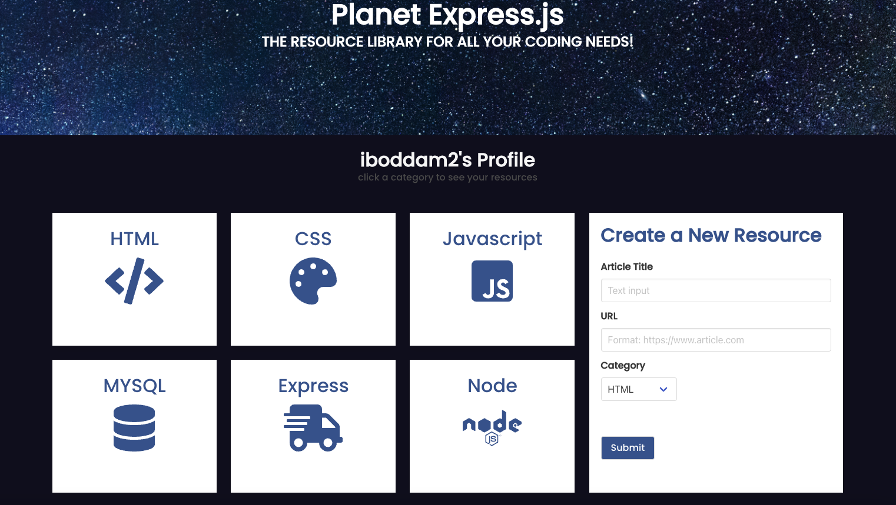
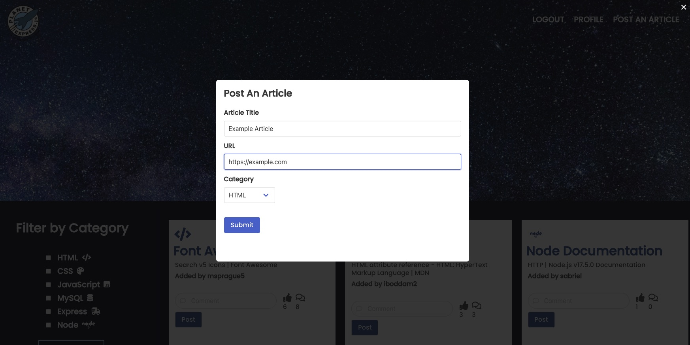

# planet-express-js

Link to Repo: [GITHUB-REPO](https://github.com/mhowitz/planet-express-js)

Link to deployed site: [HEROKU-Link](https://planet-express-js.herokuapp.com/)

Link to deployed site: [HEROKU-Link]https://planet-express-js.herokuapp.com/

## Description

An innovative new web application that allows you save and organize resources from all over the World Wide Web with efficiency and ease. No more scrolling through endless bookmarks looking for obscure documentation, no more fruitless google searches, Planet Express.js is here to help you become a better student, programmer, or developer!

## Table of Contents

* [Installation](#installation)
* [Usage](#usage)
* [License](#license)
* [Contributing](#contributing)
* [Questions](#questions)

## Installation

Clone the GitHub repo to the user's computer. Run "npm i" in the terminal to install all of the necessary packages. Then connect to the database in mysql by typing "source db/schema.sql". Exit mysql and type "npm run seed" into the terminal to populate the database. Finally, the user can start the server using "npm start" or "node server". 

## Usage

Planet Express.js is a beautiful, unique resource library created by a team of experts that specialize in inefficiently saving bookmarks and documentation - Planet Express.js was created with you in mind! Simply enter the URL for the vital resource, name it, and assign it category - Planet Express.js will do the rest!

Find needed resources quickly by using our patented filter functions! Log in to your own profile to see resources you’ve previously posted and even comment and upvote resources posted by other users!

Link to Walk-through Video: [VIDEO](https://youtu.be/pJSaqMgbeCU)

Homepage:

Login page:

User profile:

Posting an article:

## License 

[MIT License Link](https://choosealicense.com/licenses/mit/)

MIT License

Copyright (c) 2022 Mikayla Howitz

Permission is hereby granted, free of charge, to any person obtaining a copy of this software and associated documentation files (the "Software"), to deal in the Software without restriction, including without limitation the rights to use, copy, modify, merge, publish, distribute, sublicense, and/or sell copies of the Software, and to permit persons to whom the Software is furnished to do so, subject to the following conditions:

The above copyright notice and this permission notice shall be included in all copies or substantial portions of the Software.

THE SOFTWARE IS PROVIDED "AS IS", WITHOUT WARRANTY OF ANY KIND, EXPRESS OR IMPLIED, INCLUDING BUT NOT LIMITED TO THE WARRANTIES OF MERCHANTABILITY, FITNESS FOR A PARTICULAR PURPOSE AND NONINFRINGEMENT. IN NO EVENT SHALL THE AUTHORS OR COPYRIGHT HOLDERS BE LIABLE FOR ANY CLAIM, DAMAGES OR OTHER LIABILITY, WHETHER IN AN ACTION OF CONTRACT, TORT OR OTHERWISE, ARISING FROM, OUT OF OR IN CONNECTION WITH THE SOFTWARE OR THE USE OR OTHER DEALINGS IN THE SOFTWARE.

## Contributing
Jason Wisniewski  
Sabriel Gee  
Mikayla Howitz  
David Tait  

## Questions
Github usernames: mhowitz, davidtait1996, JasonWisniewski, sabrielg

Github link : https://github.com/mhowitz/planet-express-js

